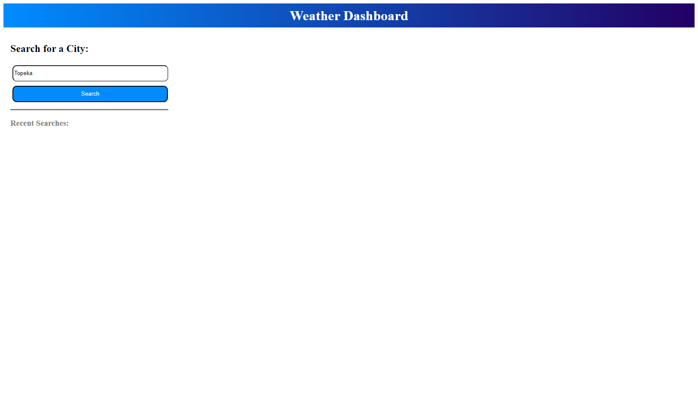

# Alex Clayton's Weather Dashboard

## Introduction
This project was developed by Alex Clayton as part of the KU Coding Bootcampt 06-Server-Side APIs Challenge.  This is a weather dashboard that fetches information from the OpenWeather API and displays the current weather of an indicated city as well as a 5-day forecast.

## What's in the project?
The acceptance criteria for this project are as follows:

1.  WHEN I search for a city
    THEN I am presented with current and future conditions for that city and that city is added to the search history

    This was achieved by using the fetch() method for the OpenWeather API.  A fetch URL was created using unique lattitude and longitude coordinates for the searched city.  The returned response was converted to a JSON object, and data was then retrieved from the object and appended to DOM elements on the page according to the challenge criteria.  A recent search button for the city was dynamically created after the initial search to be called back on in the future.

2.  WHEN I view current weather conditions for that city
    THEN I am presented with the city name, the date, an icon representation of weather conditions, the temperature, the humidity, and the wind speed

    This information was retrieved from the JSON object returned by the fetch() method and appended to the DOM accordingly.

3.  WHEN I view future weather conditions for that city
    THEN I am presented with a 5-day forecast that displays the date, an icon representation of weather conditions, the temperature, the wind speed, and the humidity

    A separate fetch() method was required for this data.  Like the current weather, a JSON object was returned, and the information within said JSON object was appended to the DOM accordingly.

4.  WHEN I click on a city in the search history
    THEN I am again presented with current and future conditions for that city

    onclick functions were dynamically added each time a recent search button was created.  The onlick functions fetched the required information from the OpenWeather API, the response was converted to a JSON object, and the data was appended to the DOM accordingly.

5.  Technical Acceptance Criteria:

    Uses the OpenWeather API to retrieve weather data.
    
    The OpenWeather API was used to retrieve all the information appended to the DOM in the deployed URL.

    Uses localStorage to store persistent data.

    Still working on this one...

## The completed project resembles the following image when deployed:

Full Size desktop view

## URL of the Deployed Application:

[Deployed Application](https://alexclaytonbootcamp.github.io/Module-6-Challenge-Weather-Dashboard/)

## Resources

OpenWeather API Key aa5a9bd886dab3a65130eaa89476e34e